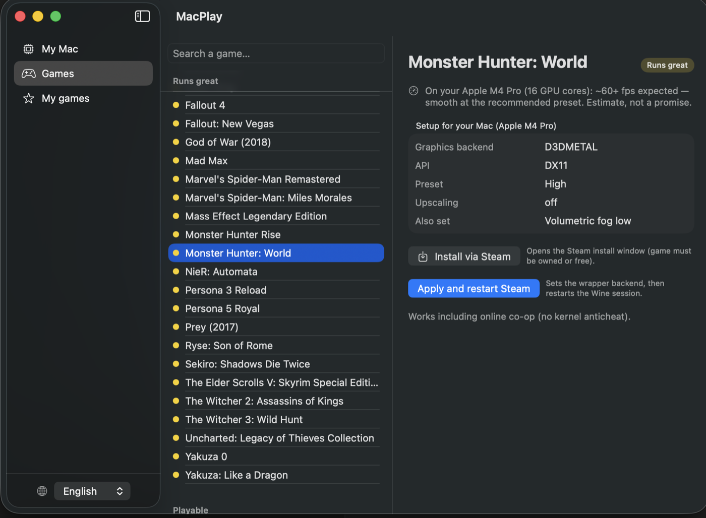
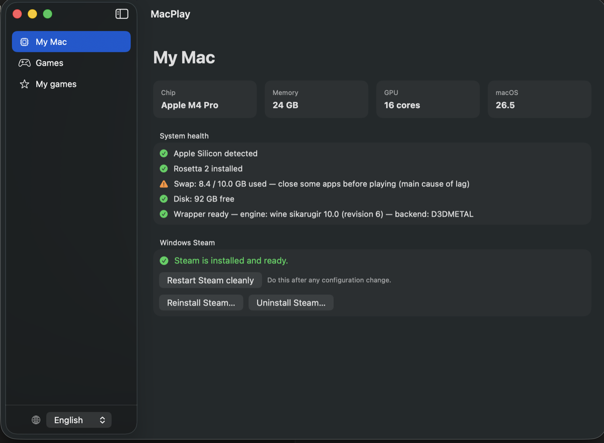

# MacPlay

**Play Windows games on your Mac — without touching a terminal.**

MacPlay is a small native macOS app (SwiftUI, Apple Silicon) that makes Windows gaming
on Mac accessible to everyone: one-click Steam setup, per-game graphics engine
selection, settings tuned to your exact chip, and community compatibility ratings.

> ⚠️ **Alpha.** This is an early build, shared to get feedback. Expect rough edges.
> Please [open an issue](../../issues) for anything broken, confusing, or missing.



## Standing on the shoulders of giants

MacPlay is a friendly front-end. **All the hard parts come from other projects:**

- **[Sikarugir](https://github.com/Sikarugir-App/Sikarugir)** — the Wine wrapper stack
  MacPlay installs and drives (a continuation of the Wineskin/Kegworks lineage by
  [@Gcenx](https://github.com/Gcenx)). MacPlay downloads the official Sikarugir wrapper,
  engines and winetricks at setup time; none of their binaries are redistributed here.
- **[Wine](https://www.winehq.org/)** — the Windows compatibility layer itself.
- **D3DMetal** (Apple's Game Porting Toolkit), **[DXVK](https://github.com/doitsujin/dxvk)**
  and **[DXMT](https://github.com/3Shain/dxmt)** — the DirectX → Metal/Vulkan translation
  that makes games actually run.

MacPlay is not affiliated with any of these projects, with Valve, or with Apple.
If you find MacPlay useful, those projects deserve your stars first.

## What it does

- **One-click Steam setup** — downloads and assembles the whole Wine + Steam stack
  (engine, prefix, fonts, known workarounds). Reinstall or uninstall just as easily.
- **Per-chip advice, not generic advice** — reads your exact Mac (M-series generation,
  GPU cores, RAM) and recommends a preset, upscaling and an honest fps estimate per game.
- **The right graphics engine per game** — D3DMetal / DXMT / DXVK / WineD3D, applied in
  one click. A curated database ships with ~80 games (from Elden Ring to The Witcher 3).
- **Launch from the app** — MacPlay boots Steam with your game and watches the session:
  if the game crashes right away, it suggests trying another engine.
- **Community ratings with context** — rate a game 1–5★; the report is sent anonymously
  *with your hardware profile and the engine used*, so "runs great" actually means
  something.
- **Honest about limits** — games with kernel anticheat (Fortnite, Valorant, Destiny 2…)
  are flagged as blocked instead of wasting your evening.
- **English & French** UI, follows your system language.



## Install

**Requirements:** Apple Silicon (M1 or later), macOS 13+.

1. Download **[MacPlay.dmg](../../releases/latest)**.
2. Open the dmg, drag MacPlay to Applications.
3. First launch: macOS will refuse to open it (this build isn't notarized — that
   requires a paid Apple Developer account). Click **Done** (not "Move to Trash"),
   then go to **System Settings → Privacy & Security → Open Anyway**. One time only.

## What it touches (security)

Fair question for any app, doubly so for an alpha you found on Reddit. Short version:
**no admin password, no root, no sandbox escape into your data.** Everything is in the
open — read [`app/Sources/MacPlay/Engine.swift`](app/Sources/MacPlay/Engine.swift), it's
the whole story.

What MacPlay **does**:

- **Writes only to folders you already own** — `~/Applications/Sikarugir/` (the Steam
  wrapper) and `~/Library/Caches/macplay` + `~/.cache/winetricks` (downloads). It never
  writes to `/System`, `/Library`, or anywhere privileged.
- **Downloads and runs third-party components at setup** — the Sikarugir wrapper, Wine
  engines, winetricks and Steam's installer, from GitHub, `raw.githubusercontent.com` and
  Steam's CDN. This is the same thing every Wine wrapper (Sikarugir, Whisky, CrossOver)
  does; it's how Windows games run on a Mac at all.
- **Runs standard system binaries** via shell: `curl`, `tar`, `xattr`, `chmod`, `open`,
  `sysctl`, `system_profiler`, plus the bundled `wine`.
- **Removes the quarantine flag** (`xattr -dr com.apple.quarantine`) from the wrapper it
  downloaded, so Wine can launch — this is a deliberate, scoped Gatekeeper bypass on
  MacPlay's own files only.
- **Sends anonymous ratings** — when you rate a game, the score plus your hardware profile
  (chip, RAM, macOS, engine used) is POSTed to the ratings backend. No account, no personal
  data, and only when you click "Send".

What it **never** does: ask for your password, request root, read your files/keychain/other
apps, or install a background service or launch agent.

Because it's open source, none of this is "trust me" — it's `grep`-able.

## Build from source

```bash
cd app
./build.sh          # → dist/MacPlay.app (SwiftUI via SPM, no Xcode project needed)
```

The repo also contains the original Python prototype of the engine
(`macplay.py`, dev tool only) and the games database (`data/games.json`).

## Contributing / feedback

This alpha exists to collect feedback:

- 🐛 **Something broke?** Open an issue with your chip (e.g. M2 Pro), macOS version,
  the game, and what happened.
- 🎮 **A game is missing or misrated?** Issues and PRs against `data/games.json`
  are very welcome — that database is the heart of the project.
- 💡 **Ideas** on making this simpler for non-technical users are the most valuable
  thing you can send.

## Known limitations (alpha)

- **Steam only** for now (Battle.net, Epic, GOG are on the wish list).
- Steam's self-updates can be capricious under Wine — if Steam hangs or misbehaves
  after an update, use **"Restart Steam cleanly"** in MacPlay's My Mac tab; that
  resolves most of it.
- Not notarized → the one-time Gatekeeper dance described above.
- Launching a game restarts Steam if it was already open (Wine can't forward commands
  to a running Steam instance).
- One wrapper, one engine at a time: the engine choice is global and applied per session.
- Kernel-anticheat multiplayer games will never work through translation.

## Also in this repo

- **[`darts/`](darts/README.md)** — 🎯 *301*, a small darts scoreboard for 2–5 players,
  with checkout and strategy hints for the next dart. Plays on a single phone
  (offline **[Android APK](darts/android/301-flechettes.apk)**, 37 KB, no permissions)
  or with one phone per player over Wi-Fi, via a zero-dependency Node server:
  `node darts/server.js`.

## License

[MIT](LICENSE) — for MacPlay's own code and data. The components MacPlay downloads at
setup time (Sikarugir wrapper, Wine engines, winetricks, D3DMetal) belong to their
respective projects under their own licenses.
