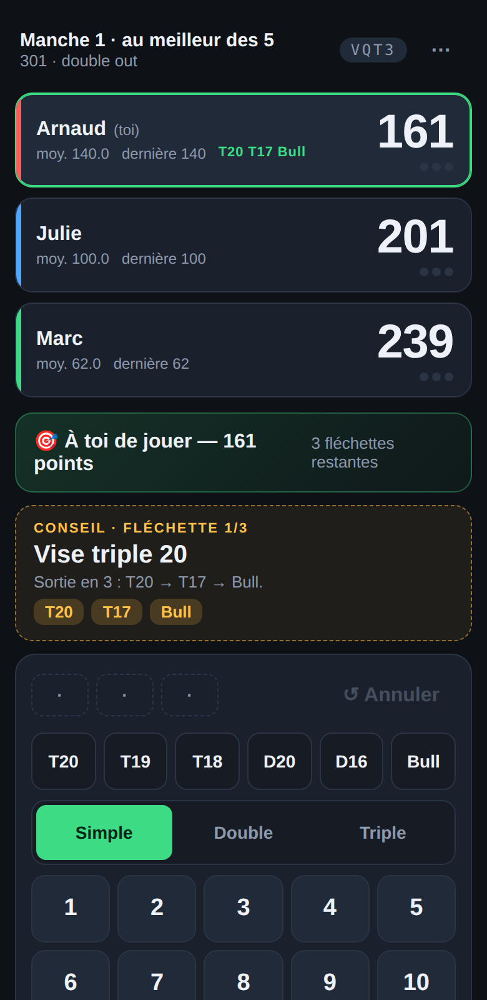
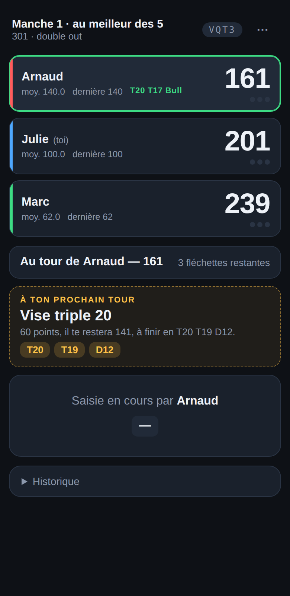
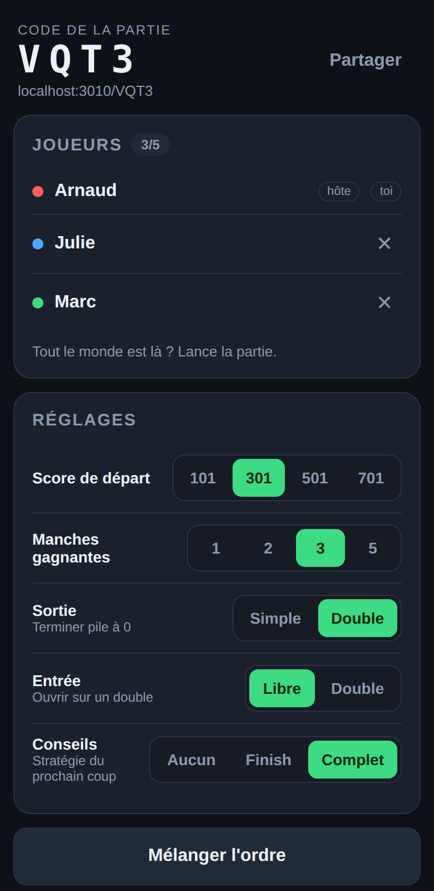

# 🎯 301 — fléchettes multijoueur

Une petite appli web pour jouer au **301** (ou 101 / 501 / 701) à **2 à 5 joueurs**.
Chacun ouvre la partie sur son téléphone, **saisit ses propres fléchettes**, et tout le
monde voit le tableau **se mettre à jour en direct** — y compris fléchette par fléchette
pendant qu'un joueur est en train de marquer.

En prime, l'appli calcule pour chaque joueur **la stratégie du prochain coup** :
la route de sortie quand elle existe (`Vise triple 20 — Sortie en 2 : T20 → D20`),
et sinon la fléchette à jouer pour se laisser un bon double
(`Dernière fléchette : 30 points pour laisser 36, à finir en D18`).

| Celui qui lance | Les autres, en direct |
| --- | --- |
|  |  |

## Lancer

```bash
node darts/server.js          # → http://localhost:3010
PORT=8080 node darts/server.js
```

Aucune dépendance : uniquement Node ≥ 18 et la bibliothèque standard.

Le serveur affiche au démarrage l'adresse à utiliser sur le Wi-Fi
(`http://192.168.x.x:3010`). Tous les joueurs doivent être sur **le même réseau** que la
machine qui fait tourner le serveur.

## Une partie

1. L'hôte ouvre l'appli, entre son prénom et **crée une partie** → un code à 4 lettres.
2. Les autres ouvrent la même adresse, entrent le code (ou scannent le lien partagé
   `http://…/ABCD`) et rejoignent.
3. L'hôte règle le score de départ, le nombre de manches gagnantes, la sortie
   (simple ou double), l'entrée (libre ou double) et le niveau de conseils, puis lance.
4. Chacun saisit ses trois fléchettes sur son propre téléphone quand c'est son tour.
   Les autres voient le score bouger en temps réel.



Raccourcis pratiques : `T20 / T19 / T18 / D20 / D16 / Bull` en haut du pavé,
sélecteur `Simple / Double / Triple` pour les autres nombres, `↺ Annuler` pour une
fléchette mal saisie, et **Annuler la dernière volée** dans le menu `⋯`.

## Règles implémentées

- Décompte à partir de 101 / 301 / 501 / 701, trois fléchettes par volée.
- **Bust** : la volée est annulée et le score revient à sa valeur de début de volée si
  le joueur passe sous 0, tombe sur 1 (en sortie double) ou termine à 0 sans double.
- **Sortie double** (par défaut) : la dernière fléchette doit être un double (ou le bull).
- **Entrée double** (optionnelle) : rien ne compte tant que le joueur n'a pas ouvert
  sur un double.
- **Manches** : 1, 2, 3 ou 5 manches gagnantes ; le joueur qui commence tourne à chaque
  manche.
- Statistiques par joueur : moyenne à 3 fléchettes, meilleure volée, nombre de 100+.

## Conseils de stratégie

Réglable par match : `Aucun` · `Finish` (uniquement les sorties) · `Complet`.

Le moteur (`lib/darts.js`) calcule :

- **Les routes de sortie** par recherche exhaustive sur les 62 segments, en préférant les
  routes des tables classiques — `170 → T20 T20 Bull`, `141 → T20 T19 D12`,
  `100 → T20 D20`, `60 → 20 D20`. Le choix pénalise les cibles difficiles et privilégie
  les doubles confortables (D20, D16) plutôt que D2 ou D1.
- **Le placement** quand la sortie n'est pas possible : sur les deux premières fléchettes
  on cherche le maximum de points, sur la dernière on optimise le reliquat laissé
  (`48 → vise 16 pour laisser 32`, `100 → vise T20 pour laisser 40`), en évitant
  toujours de laisser 1 point ou un *bogey number* (169, 168, 166, 165, 163, 162, 159).

## Architecture

```
darts/
├── server.js        HTTP + Server-Sent Events, sans dépendance
├── lib/darts.js     segments, recherche de sortie, moteur de conseils (pur)
├── lib/match.js     état d'une partie : joueurs, volées, bust, manches, statistiques
├── public/          client web (HTML/CSS/JS, mobile d'abord)
└── test/            tests unitaires (node --test)
```

Le serveur est la seule source de vérité : un client envoie une action
(`POST /api/matches/:code/action`), le serveur valide (c'est bien ton tour ?) et diffuse
l'état complet à tous les flux SSE ouverts. Un rechargement de page rejoint la partie
automatiquement grâce au jeton stocké dans le navigateur.

### API

| Méthode | Route | Rôle |
| --- | --- | --- |
| `POST` | `/api/matches` | créer une partie (renvoie le code + le jeton de l'hôte) |
| `POST` | `/api/matches/:code/join` | rejoindre (ou se reconnecter avec son jeton) |
| `GET` | `/api/matches/:code` | état courant |
| `GET` | `/api/matches/:code/stream` | flux SSE des états |
| `POST` | `/api/matches/:code/action` | `start`, `throw`, `undo-dart`, `undo-turn`, `next-leg`, `rematch`, `settings`, … |

L'état diffusé ne contient jamais les jetons des joueurs.

## Tests

```bash
cd darts && npm test        # ou : node --test 'test/*.test.js'
```

29 tests couvrent les règles (bust, sortie double, entrée double, annulations, manches),
le moteur de conseils (routes de sortie classiques, bogey numbers, jamais laisser 1) et
le serveur lui-même (création, jonction, diffusion SSE, refus de jouer hors de son tour).
